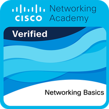

# Hi there, I'm Dayana Gretel Rojas Valencia 👋

## About Me

Systems Engineering student at Universidad Católica Boliviana "San Pablo" (La Paz, Bolivia), focused on **backend development, databases and software architecture**.
I build REST APIs with Node.js (NestJS) and Python (FastAPI, Flask), design relational databases with PostgreSQL and Supabase, and develop web and mobile apps with React and Flutter.

- 🚀 Currently working on **CAM-Run**, a production platform for a charity race that raises funds for a women's support center in Bolivia
- 🏗️ Software Architect & Backend Developer for a patent-registration platform for robotics inventors
- 🗄️ Designed the database for the Sports Department system of UCB
- 🧪 Former Computer Lab Assistant at UCB (2025)
- 🌎 Spanish (native) · English (intermediate) · Korean (basic)

---

## Connect with Me

---

## Featured Projects

- **[CAM-Run](https://github.com/Rosav-dotcom/canvincentino-hps)** — Registration and race-control platform for a 5K/10K charity race in support of the Centro de Atención a la Mujer (CAM). Runner sign-up, QR and cash payments, automatic email confirmation and race timing. *In production.*
- **University Sports Management System** — Microservices system for the UCB Sports Department (users, roles, teams, tournaments, bookings, reports). NestJS, React, PostgreSQL, Docker.
- **[AgroVision](https://github.com/Joserppz/agrovision-app)** — Mobile app that detects plant diseases from photos with on-device AI models and a FastAPI backend. Flutter, Supabase, geolocation.
- **[Payments & Billing Module](https://github.com/Dmntrix82/TallerSis)** — Supermarket management system with Node.js microservices for payments, cash register and billing, running on Docker.
- **RFID Plate Identification Controller** — Vehicle control system using RFID readers and a Flask web app.

---

## Tech Stack

### Languages

### Backend & Frameworks

### Frontend & Mobile

### Databases

### Data & BI

### DevOps & Tools

---

## Current Focus

- Backend development with NestJS and FastAPI
- Database design and advanced SQL
- Software architecture (C4 model) and microservices
- Secure web platforms that protect sensitive user data

---

## Certifications

**Networking Basics**  
Cisco Networking Academy · 2026 · [View credential](https://www.credly.com/earner/earned/share/8e62b5b3-0d03-4b42-b70f-0964f6e930fa)
